# Unison Cloud architecture

At a high level, the system architecture for Unison Cloud looks like this:

```mermaid
flowchart LR
    dev("🧑‍💻 Developer<br/>ucm, @unison/cloud library")
    browser("🌐 Client <br/>browser, curl, external service, etc")
    internet("🌐 Public internet")
    subgraph data-plane["☁️ Data plane (your infra)"]
        reverse-proxy("Reverse proxy<br/>(optional)<br>Nginx, Caddy, etc")
        subgraph nimbus["Nimbus instance"]
            nimbus-public@{ shape: comment, label: "Public HTTP port" }
            nimbus-gossip@{ shape: brace-r, label: "Gossip port" }
        end
        other-nimbus-instances@{ shape: processes, label: "Other nimbus instances" }
        storage[("Storage (DynamoDB)")]
        blobstore[("Blobs (S3)")]
        secrets[("Secret store (Vault)")]
        outbound-proxy["Outbound proxy<br/>(optional)"]
    end
    control-plane("☁️ Control plane<br/>(Unison Computing infra)")
    dev -->|Cloud.run auth| control-plane
    dev -->|Cloud.run| reverse-proxy
    reverse-proxy --> nimbus-public
    browser -->|HTTP request to user-deployed service| reverse-proxy
    nimbus --> storage
    nimbus --> blobstore
    nimbus --> secrets
    nimbus --->|Persistent WebSocket| control-plane
    nimbus --> outbound-proxy --> internet
    nimbus-gossip <--> other-nimbus-instances
```

The server side of Unison Cloud is divided between the [control plane](#control-plane) and the [data plane](#data-plane). The **control plane** is in charge of authentication/authorization and coordination, while the **data plane** runs user jobs/services and houses user data.

To understand the connections between these components it may be helpful to see a diagram of the sequence of events when a developer deploys a Unison Cloud web service and then another user accesses it:

## Control plane

The control plane is in charge of authentication/authorization and coordination of Unison Cloud clusters. It typically runs on centralized Unison Computing infrastructure (but contact us if you have other needs) and does not have access to the user/application secrets, code, or data that are housed in the data plane.

Interactions with the control plane go through an HTTP API that you may see referred to as `cloud-api`.

### Authentication and authorization

The control plane manages two separate types of **authentication**:

- Nimbus nodes requesting to join a cluster
- Developers or CI/CD servers submitting jobs, deploying services, creating databases, etc. These requests typically come from the [cloud client][cloud-client].

While **authentication** uses long-lived credentials, **authorization** for job submissions, service deployments, etc is enabled via narrowly-scoped per-request tokens.

See [the security guide][auth] for details about authentication and authorization.

### Cluster membership and orchestration

One of the primary functions of the control plane is to keep track of cluster membership. As each Nimbus node starts up, it establishes a persistent connection to the control plane, registering with a location ID and address (URI). The control plane then broadcasts a message to other connected Nimbus nodes to inform them about the new cluster member. It sends periodic health checks to each Nimbus instance and will alert other nodes if one disconnects or fails health checks.

As the source of truth on cluster membership, the control plane also orchestrates cluster operations. For example it informs each node which [daemons][daemons] it should run.

### Cluster events

The control plane broadcasts messages to each connected Nimbus node to keep it updated on cluster events. In many cases these events are used to optimize/invalidate local caches. Events include:

- members joining, leaving, or failing health checks (mentioned above)
- [Environment][Environment] changes, such as a [Config][env-config] value changing
- user service changes, such as a new implementation being assigned to a [service name][ServiceName]

## Data plane

### Nimbus

Nimbus instances are the primary workers of a Unison Cloud cluster. They run user-submitted jobs (via [Cloud.submit][Cloud.submit]) and services (via [Cloud.deploy][Cloud.deploy]), supporting the [Remote ability][Remote] for distributed programs.

Nimbus is itself implemented in Unison and greatly benefits from the Unison programming language's support for distributed computation:

- Values and entire programs/services can be serialized and sent to another node to distribute computation.
- Thanks to content-addressed code there are never runtime dependency conflicts or name collisions, even in a shared cluster.
- User code is sandboxed with fine-grained control of which operations are permitted.

Nimbus serves a few different types of requests:

- Authenticated developer requests to run jobs, deploy services, and other functionality provided by the [cloud client][cloud-client]. These arrive via the public HTTP port.
- Unauthorized requests to user-deployed services that arrive via the public HTTP port under dedicated `/s/` (service name) and `/h/` (service hash) endpoints. The underlying user-defined web service may implement its own authentication, but Nimbus itself considers these endpoints to be public.
- Nimbus cluster peer requests that arrive via the gossip port. These are requests supporting distributed computation such as "run this program in a new thread", "cancel this thread", "atomically modify this mutable reference", and "read this promise and send me the result when it is available".

For more details on Nimbus authentication and ports see the [security documentation][security].

### Transactional Storage

The transactional storage provider of the data plane supports the [Storage][Storage] ability. Currently the only supported backend is [DynamoDB][DynamoDB].

### Blob store

The blob store provider of the data plane supports the [Blobs][Blobs] ability. Currently blob stores with an [s3][s3]-compatible API are supported.

### Secrets

The secrets provider of the data plane supports the [Environment][Environment] and [Environment.Config][Environment.Config] abilities. Currently [Vault][vault] is supported, but we plan to support other secrets providers as requested.

### Outbound proxy

The data plane can optionally configure an outbound network proxy that will be used for all user [{Http}][Http] and [{Tcp}][Tcp] requests. This may be your existing corporate proxy or could be a custom [squid][squid] proxy that only lets user code connect to vetted domains/ports/IPs/etc.

[auth]: security.md
[Blobs]: https://share.unison-lang.org/@unison/cloud/code/releases/21.2.0/latest/types/Blobs
[cloud-client]: https://share.unison-lang.org/@unison/cloud
[Cloud.deploy]: https://share.unison-lang.org/@unison/cloud/code/releases/21.2.0/latest/terms/Cloud/deploy
[Cloud.submit]: https://share.unison-lang.org/@unison/cloud/code/releases/21.2.0/latest/terms/Cloud/submit
[daemons]: https://share.unison-lang.org/@unison/cloud/code/releases/21.2.0/latest/types/Daemon
[DynamoDb]: https://docs.aws.amazon.com/dynamodb/
[Environment]: https://share.unison-lang.org/@unison/cloud/code/releases/21.2.0/latest/types/Environment
[Environment.Config]: https://share.unison-lang.org/@unison/cloud/code/releases/21.2.0/latest/types/Environment/Config
[env-config]: https://share.unison-lang.org/@unison/cloud/code/releases/21.2.0/latest/types/Environment/Config
[Http]: https://share.unison-lang.org/@unison/http/code/releases/5.0.2/latest/types/client/Http
[Remote]: https://share.unison-lang.org/@unison/cloud/code/releases/21.2.0/latest/types/Remote
[security]: security.md
[ServiceName]: https://share.unison-lang.org/@unison/cloud/code/releases/21.2.0/latest/types/ServiceName
[s3]: https://aws.amazon.com/s3/
[squid]: https://www.squid-cache.org/
[Storage]: https://share.unison-lang.org/@unison/cloud/code/releases/21.2.0/latest/types/Storage
[Tcp]: https://share.unison-lang.org/@unison/cloud/code/releases/21.2.0/latest/types/provisional/Remote/Tcp
[vault]: https://www.hashicorp.com/en/products/vault
