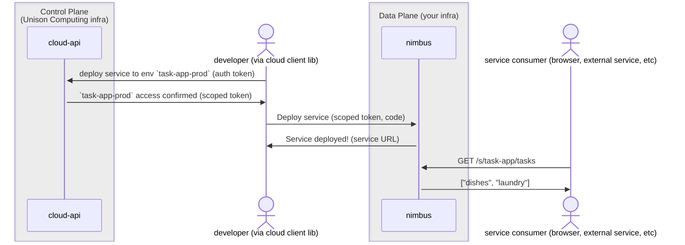

# Unison Cloud security

This document provides a security overview of Unison Cloud. It will be helpful to first familiarize yourself with the [Unison Cloud architecture][architecture].

## User (developer) authentication

Before allowing a developer (or a CI/CD job) to create an environment, submit a job, deploy a service, we must validate their identity.

[Unison Share][Share] acts as the authentication server for Unison Cloud. It implements [OAuth2](https://datatracker.ietf.org/doc/html/rfc6749) with
the [PKCE extension](https://www.oauth.com/oauth2-servers/pkce/), and a subset of the [OpenID Connect Core](https://openid.net/specs/openid-connect-core-1_0.html) and [OpenID Discovery specifications](https://openid.net/specs/openid-connect-discovery-1_0.html). Its open-source auth implementation can be found [here][share-auth]. Its current JSON Web Key Set can be found at its [.well-known/jwks.json endpoint](https://api.unison-lang.org/.well-known/jwks.json).

## User (developer) authorization

While **authentication** uses long-lived OAuth credentials, **authorization** for job submissions, service deployments, etc is enabled via narrowly-scoped per-request JWT. The developer first requests a request token from the control plane, which verifies that they have authorization to act on the requested environment/service/etc. It then provides the developer a narrowly-scoped request token along with a redirect to the data plane. The data plane verifies the request token and then performs the requested token.

An example sequence of requests and responses when a developer deploys a Unison Cloud web service and then another user sends the service a request might look like this:



## Cluster member authentication

When a Nimbus member connects to the control plane to join the cluster, it authenticates using a random token generated by the control plane at cluster creation time. At any time a cluster administrator can make an authenticated request to the control plane to generate new tokens and revoke old tokens.

## Service authentication and authorization

When a developer deploys a Unison Cloud service via [Cloud.deploy], by the default the service is public and does _not_ perform any authentication. If developers want to secure the service they can do so in their Unison code, such as by utilizing the [@unison/auth library][unison-auth].

## Network security

### VPC/firewall

It's best practice to run Nimbus nodes (and as much of the data plane as practical) within a VPC or limited-access network. Nimbus nodes initiate requests to the control plane and establish a persistent WebSocket connection on startup, so there is no need for them to allow incoming connections from the control plane or anyone else.

### Nimbus gossip port

The most important security consideration when deploying nimbus is:

✋ **The Nimbus gossip port is trusted and should remain private** ✋

Nimbus assumes that requests coming in through its gossip port are from Nimbus peers and trusts them. Nimbus instances need to be able to talk to their peers' gossip ports, but nobody else should need to. You may want to deploy a small sidecar proxy (such as [Envoy][envoy]) next to each Nimbus instance to gate access to its gossip port.

If this is a concern for you and you aren't in a good position to secure the gossip port via other means, reach out to Unison Cloud support to discuss options.

### Nimbus public HTTP port

The Nimbus public HTTP port is considered safe to expose publicly. It handles:

- HTTP requests to user-deployed Unison Cloud services. These are public or implement their own auth. See [service auth][service-auth].
- Developer requests from the [cloud client][cloud-client] to run a job, deploy a service, etc. These validate narrowly-scoped tokens generated by the control plane. See [User (developer) authorization][developer-authorization].

You'll likely want to deploy a reverse proxy/load balancer in front of Nimbus's public port to distribute service requests across nodes and to terminate TLS.

While it's referred to as the "public" HTTP port, there is no _need_ to make it publicly accessible. If your requests should only come from other services within a VPC or from clients connected to your VPN, then there's no reason to expose your instances beyond that network.

## User-provided code execution

Like Hadoop/Spark clusters, Kubernetes/Nomad clusters, and many other cloud offerings, nimbus nodes run user-provided code in submitted jobs and deployed services. Let's be real: at some level this is remote code execution as a service. However, Nimbus is able to lean on the strengths of the Unison programming language to mitigate the risks of running arbitrary code.

### Content-addressed code

All code in Unison (and by extension user code submitted to Nimbus) is content-addressed. When a user (or cluster peer) sends a computation to a Nimbus node, they don't say that they want to run `Environment.Config.expect`; they specify that they want to run the function with the hash `01bga3jq5u8ev85lsatbqip9hkrgr4jtr4li520b0r5gpvmi9el30`. If the receiving node already has a definition for `01bga3jq5u8ev85lsatbqip9hkrgr4jtr4li520b0r5gpvmi9el30` then it can proceed with the computation. If it does _not_ know the definition that hashes to `01bga3jq5u8ev85lsatbqip9hkrgr4jtr4li520b0r5gpvmi9el30`, then it will ask for a definition. Upon receiving the requested definition it verifies that the provided code matches the specified hash.

This unique approach provides significant benefits:

- Two versions of `Environment.Config.expect` never collide. They aren't identified by the string `Environment.Config.expect` in a mutable bag of strings known as a classpath. User code specifies the _exact_ version of `Environment.Config.expect` via hash and the runtime is never aware that the two distinct definitions happened to both be named `Environment.Config.expect` at different points in time or in different codebases.
- A malicious user cannot pollute the runtime code namespace with hijacked implementations of terms. Imagine that a malicious user wanted to override `Environment.Config.expect` to send the key/value to a remote server before returning them. They may succeed in finding a Nimbus node without a definition for `Environment.Config.expect`, and they could even get that node to request the definition! But then their efforts will fall apart. If they provide anything other than the actual implementation then the definition will no longer hash to `01bga3jq5u8ev85lsatbqip9hkrgr4jtr4li520b0r5gpvmi9el30` and code from other users that calls `Environment.Config.expect` will be blissfully ignorant of any definition with a different hash.

### Code sandboxing

Addressing code by its content isn't enough to make it safe to run arbitrary user code. For example you wouldn't want a malicious user to be able to submit a Unison Cloud job that looked like:

```
Cloud.submit Environment.default() do
  doBadStuff = coerceAbilities do
    getEnv "AWS_SECRET_ACCESS_KEY"
  doBadStuff()
```

Luckily, the Unison programming language supports fine-grained code sandboxing. Before Nimbus runs any user-provided code (via job submission, service deployment, etc), it runs the code through [reflection.Value.validateSandboxed][Value.validateSandboxed]. By default it disallows all code that performs IO or uses reflection to dynamically load code/values. By default it does allow a small number of builtins that are tracked as being potential sandbox candidates such as `toDebugText` which returns a textual representation of an arbitrary value (in practice this one is harmless albeit not particularly useful since the Nimbus runtime doesn't have user-provided names for definitions). If you'd like a different set of sandbox rules for your cluster, contact Unison Cloud support, and we can make the sandbox rules configurable.

[architecture]: README.md
[cloud-client]: https://share.unison-lang.org/@unison/cloud
[Cloud.deploy]: https://share.unison-lang.org/@unison/cloud/code/releases/21.2.0/latest/terms/Cloud/deploy
[developer-authorization]: #user-developer-authorization
[envoy]: https://www.envoyproxy.io/
[Value.validateSandboxed]: https://share.unison-lang.org/@unison/base/code/releases/6.5.0/latest/terms/reflection/Value/validateSandboxed
[service-auth]: #service-authentication-and-authorization
[Share]: https://share.unison-lang.org/
[share-auth]: https://github.com/unisoncomputing/share-api/tree/main/share-auth
[unison-auth]: https://share.unison-lang.org/@unison/auth
